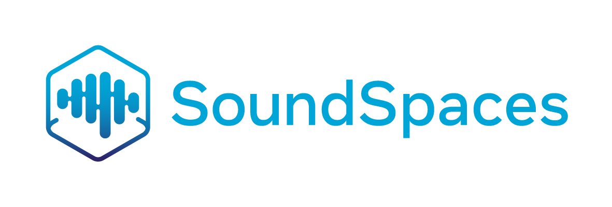
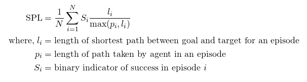

<p align="center">
  
  </p>

--------------------------------------------------------------------------------

# SoundSpaces Challenge 2023

This repository contains starter code for the 2023 challenge, details of the tasks, and training and evaluation setups. For an overview of SoundSpaces Challenge visit [soundspaces.org/challenge](https://soundspaces.org/challenge/). 

This year, we are hosting challenges on audio-visual navigation task [1], where an agent is tasked to find a sound-making object in unmapped 3D environments with visual and auditory perception.


## AudioNav Task
In AudioGoal navigation (AudioNav), an agent is spawned at a random starting position and orientation in an unseen environment. A sound-emitting object is also randomly spawned at a location in the same environment. The agent receives a one-second audio input in the form of a waveform at each time step and needs to navigate to the target location. No ground-truth map is available and the agent must only use its sensory input (audio and RGB-D) to navigate.

### Dataset
The challenge will be conducted on the <a href="https://github.com/facebookresearch/sound-spaces/blob/master/soundspaces/README.md">SoundSpaces Dataset</a>, which is based on <a href="https://aihabitat.org/">AI Habitat</a>, <a href="https://niessner.github.io/Matterport//">Matterport3D</a>, and <a href="https://github.com/facebookresearch/Replica-Dataset">Replica</a>. For this challenge, we use the Matterport3D dataset due to its diversity and scale of environments. This challenge focuses on evaluating agents' ability to generalize to unheard sounds and unseen environments. The training and validation splits are the same as used in <i>Unheard Sound</i> experiments reported in the <a href="http://vision.cs.utexas.edu/projects/audio_visual_navigation/">SoundSpaces paper</a>. They can be downloaded from the <a href="https://github.com/facebookresearch/sound-spaces/tree/master/soundspaces">SoundSpaces dataset page</a> (including minival).  

### Evaluation
After calling the STOP action, the agent is evaluated using the 'Success weighted by Path Length' (SPL) metric [2]. 

<p align="center">
  
</p>


An episode is deemed successful if on calling the STOP action, the agent is within 0.36m (2x agent-radius) of the goal position.


## Participation Guidelines

Participate in the contest by registering on the <!--[EvalAI challenge page](https://eval.ai/web/challenges/challenge-page/1959/overview)-->EvalAI challenge page (coming soon) and creating a team. Participants will upload JSON files containing the evaluation metric values for the challenge and the trajectories executed by their model. The trajectories will be used to validate the submitted performance values. Suspicious submissions will be reviewed and if necessary, the participating team will be disqualified. Instructions for evaluation and online submission are provided below.

### Evaluation
1. Clone the challenge repository:  

    ```bash
    git clone https://github.com/facebookresearch/soundspaces-challenge.git
    cd soundspaces-challenge
    ```

1. Implement your own agent or try one of ours. We provide an agent in `agent.py` that takes random actions:
    ```python
    import habitat
    import soundspaces

    class RandomAgent(habitat.Agent):
        def reset(self):
            pass

        def act(self, observations):
            return numpy.random.choice(len(self._POSSIBLE_ACTIONS))

    def main():
        agent = RandomAgent(task_config=config)
        challenge = soundspaces.Challenge()
        challenge.submit(agent)
    ```

1. Following instructions for downloading SoundSpaces [dataset](https://github.com/facebookresearch/sound-spaces/tree/master/soundspaces) and place all data under `data/` folder.


1. Evaluate the random agent locally:
    ```bash
    env CHALLENGE_CONFIG_FILE="configs/challenge_random.local.yaml" python agent.py 
    ```
    This calls `eval.py`, which dumps a JSON file that contains a Python dictionary of the following type:
    ```python
    eval_dict = {"ACTIONS": {f"{scene_id_1}_{episode_id_1}": [action_1_1, ..., 0], f"{scene_id_2}_{episode_id_2}": [action_2_1, ..., 0]}, "SPL": average_spl, "SOFT_SPL": average_softspl, "DISTANCE_TO_GOAL": average_distance_to_goal, "SUCCESS": average_success}
    ```
    **Make sure that the json that gets dumped upon evaluating your agent is of the exact same type**. The easiest way to ensure that is by not modifying `eval.py`.


### Online submission

Follow instructions in the `submit` tab of the <!--[EvalAI challenge page](https://eval.ai/web/challenges/challenge-page/1959/overview)-->EvalAI challenge page (coming soon) to **upload** your evaluation JSON file.

Valid challenge phases are `soundspaces23-audionav-{minival, test-std}`.

The challenge consists of the following phases:

1. **Minival phase**: This split is same as the one used in `./test_locally_audionav_rgbd.sh`. The purpose of this phase/split is sanity checking -- to confirm that your online submission to EvalAI doesn't run into any issue during evaluation. Each team is allowed maximum of 30 submission per day for this phase. 
2. **Test Standard phase**: The purpose of this phase is to serve as the public leaderboard establishing the state of the art; this is what should be used to report results in papers. The relevant split for this phase is `test_multiple_unheard`. Each team is allowed maximum of 10 submission per day for this phase. As a reminder, the submitted trajectories will be used to validate the submitted performance values. Suspicious submissions will be reviewed and if necessary, the participating team will be disqualified. 

Note: If you face any issues or have questions you can ask them by mailing the organizers or opening an issue on this repository.

### AudioNav Baselines and Starter Code
We included both the configs and Python scripts for [av-nav](https://github.com/facebookresearch/sound-spaces/tree/master/ss_baselines/av_nav) and [av-wan](https://github.com/facebookresearch/sound-spaces/tree/master/ss_baselines/av_wan). Note that the [MapNav environment](https://github.com/facebookresearch/sound-spaces/blob/soundspaces-challenge/ss_baselines/av_wan/mapnav_env.py) used by av-wan is baked into the environment container and can't be changed. We suggest you to re-write that planning for loop in the agent code if you want to modify mapping or planning.


## Acknowledgments

Thank Habitat team for the challenge template.


## References

[1] [SoundSpaces: Audio-Visual Navigation in 3D Environments](https://arxiv.org/pdf/1912.11474.pdf). Changan Chen\*, Unnat Jain\*, Carl Schissler, Sebastia Vicenc Amengual Gari, Ziad Al-Halah, Vamsi Krishna Ithapu, Philip Robinson, Kristen Grauman. ECCV, 2020.

[2] [On evaluation of embodied navigation agents](https://arxiv.org/abs/1807.06757). Peter Anderson, Angel Chang, Devendra Singh Chaplot, Alexey Dosovitskiy, Saurabh Gupta, Vladlen Koltun, Jana Kosecka, Jitendra Malik, Roozbeh Mottaghi, Manolis Savva, Amir R. Zamir. arXiv:1807.06757, 2018.


## License
This repo is MIT licensed, as found in the LICENSE file.
